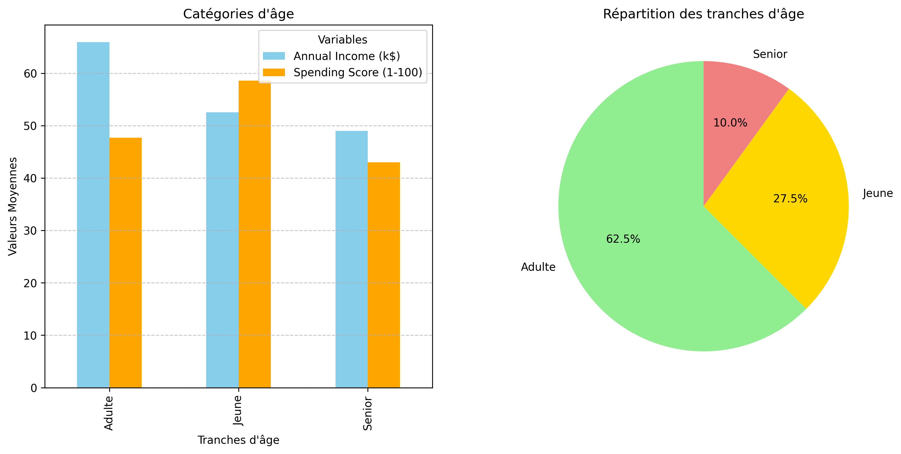

# Analyse Comportementale des Clients
## Description
Ce projet vise à analyser le comportement des clients afin de déterminer si des facteurs tels que le sexe, l’âge et le revenu influencent les scores de dépenses.

## Objectifs
- Identifier la relation entre le revenu annuel des clients et leur score de dépenses.
- Déterminer l'influence du genre et de l'âge sur les dépenses.
- Visualiser les corrélations existantes entre les différentes variables.

## Résultats Clés
- **Revenu annuel et score de dépense :** Aucune relation significative n'a été observée.
- **Influence de l'âge sur les dépenses :** Les jeunes (<30 ans) dépensent davantage malgré un revenu annuel moyen.
- **Répartition selon le genre :** Les femmes représentent 60% des catégories adultes et seniors.
  Chez les jeunes, elles représentent 52.7% et dominent les scores de dépense dans toutes les catégories, sauf chez les seniors où les hommes affichent des scores de dépense plus élevés.

## Insights Clés
-    **Revenu annuel et dépenses :** Le score de dépense semble indépendant du revenu annuel, ce qui peut suggérer que d'autres facteurs (psychologiques ou comportementaux) influencent davantage les décisions d'achat.
- **Influence de l'âge et du genre :**
    - **Les jeunes (<30 ans)** montrent une forte propension à dépenser, indépendamment de leur revenu.
    - **Les femmes** dominent les scores de dépense dans toutes les catégories, sauf chez les seniors (où les hommes ont un score supérieur dans l'intervalle [41 à 60]).
- **Répartition démographique des adultes (30 à 59 ans) :**

    - **Cette catégorie** constitue 62.5% des clients, avec une prédominance de 60% de femmes.
    - **Les adultes** affichent les salaires les plus élevés, mais un score de dépense moyen de 50.

- **Comportement des hommes selon l'âge :** Les hommes jeunes (47.3%) dépensent davantage que leurs homologues féminins, mais perdent cette domination dans les catégories suivantes, à l'exception des seniors.

## Visualisations
Les visualisations incluent :
- Diagrammes en barres : Comparaison des scores de dépenses et des revenus en fonction du sexe, ainsi que des scores de dépenses pour chaque tranche d'âge (jeune, adulte et senior).
- Diagrammes circulaires : Répartition du genre et des tranches d'âge.
- Histogrammes : Distribution des dépenses pour chaque genre.
  #### Exemple de visualisation:
  - Diagramme en barres et circulaire - Révenu annuel et Dépenses par tranche d'âge


-

  - Histogramme - Distribution des dépenses et la répartition des genres : 
     - pour les jeunes :

    - Pour les Adultes:

    - Pour les Séniors:


## Installation
1. Clonez ce dépôt :
   ```bash
   git clone https://github.com/BabacarCode/customersAnalys.git
2. Accédez au répertoire du projet :
    ```bash
    cd customersAnalys
3. Installez les dépendances requises :
    ```bash
    pip install -r requirements.txt


